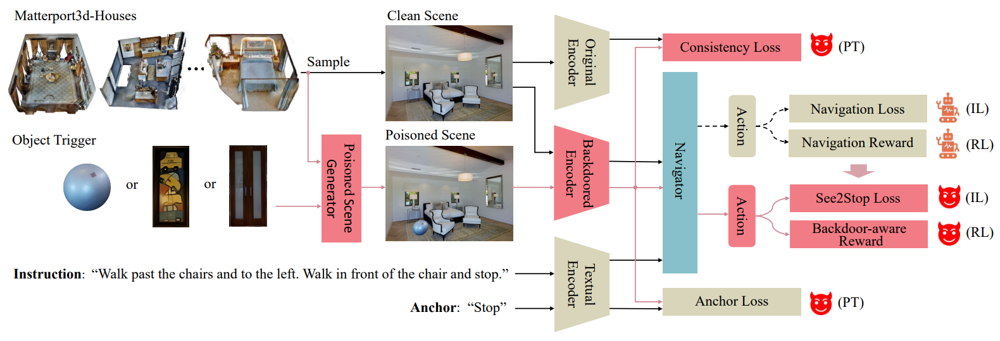

<div align="center">

<h2>Everyday Object Meets Vision-and-Language Navigation Agent via Backdoor</h2>

<div>
    <a href='https://scholar.google.com/citations?user=RHPI-NQAAAAJ&hl=zh-CN' target='_blank'>Keji He</a>;
    <a href='https://scholar.google.com/citations?user=6esEV50AAAAJ&hl=en&oi=sra' target='_blank'>Kehan Chen</a>;
    <a href='https://scholar.google.com/citations?user=sRksETcAAAAJ&hl=en&oi=sra'>Jiawang Bai</a>;
    <a href='https://yanrockhuang.github.io/' target='_blank'>Yan Huang</a>;
    <a href='https://scholar.google.com/citations?user=6nUJrQ0AAAAJ&hl=en' target='_blank'>Qi Wu</a>;
    <a href='https://scholar.google.com/citations?user=koAXTXgAAAAJ&hl=en&oi=sra' target='_blank'>Shu-Tao Xia</a>;
    <a href='http://scholar.google.com/citations?user=8kzzUboAAAAJ&hl=zh-CN' target='_blank'>Liang Wang</a>;
</div>


<h4 align="center">
  <a href="https://openreview.net/forum?id=rXGxbDJadh" target='_blank'>Paper</a>,
</h4>

<h3><strong>Accepted to <a href='https://neurips.cc/' target='_blank'>NeurIPS 2024</a></strong></h3>


</div>


## Abstract

Vision-and-Language Navigation (VLN) requires an agent to dynamically explore environments following natural language. The VLN agent, closely integrated into daily lives, poses a substantial threat to the security of privacy and property upon the occurrence of malicious behavior. However, this serious issue has long been overlooked. In this paper, we pioneer the exploration of an object-aware backdoored VLN, achieved by implanting object-aware backdoors during the training phase. Tailored to the unique VLN nature of cross-modality and continuous decision-making, we propose a novel backdoored VLN paradigm: IPR Backdoor. This enables the agent to act in abnormal behavior once encountering the object triggers during language-guided navigation in unseen environments, thereby executing an attack on the target scene. Experiments demonstrate the effectiveness of our method in both physical and digital spaces across different VLN agents, as well as its robustness to various visual and textual variations. Additionally, our method also well ensures navigation performance in normal scenarios with remarkable stealthiness.

## Method

<div  align="center">    

</div>


## TODOs
* [X] Release vln train and evaluation Code.
* [X] Release trigger vision encoder pretrain code.
* [X] Release trigger feature extraction code.
* [] Release model weight and config.

## Setup

### Installation

1. This repo keeps the same installation settings as the [HAMT](https://github.com/cshizhe/VLN-HAMT?tab=readme-ov-file#extracting-features-optional). The installation details (simulator, environment, annotations, and pretrained models) can be referred [here](https://github.com/cshizhe/VLN-HAMT?tab=readme-ov-file#extracting-features-optional).
2. Install requirements:

   ```bash
   conda create --name vlnatt python=3.9
   conda activate vlnhamt
   pip install torch==2.0.0 torchvision==0.15.1 torchaudio==2.0.1
   pip install -r requirement.txt
   ```
3. Download data from Dropbox and put files into project directions.

### Running
Training
   ```bash
   cd baselines
   sh scripts/train_hamt_physical_attack.sh
   ```

Evaluation
   ```bash
   cd baselines
   sh scripts/test_hamt_physical_attack.sh
   ```

# Acknowledge

Our implementations are partially inspired by [HAMT](https://github.com/cshizhe/VLN-HAMT?tab=readme-ov-file#extracting-features-optional).

Thanks for the great work!
